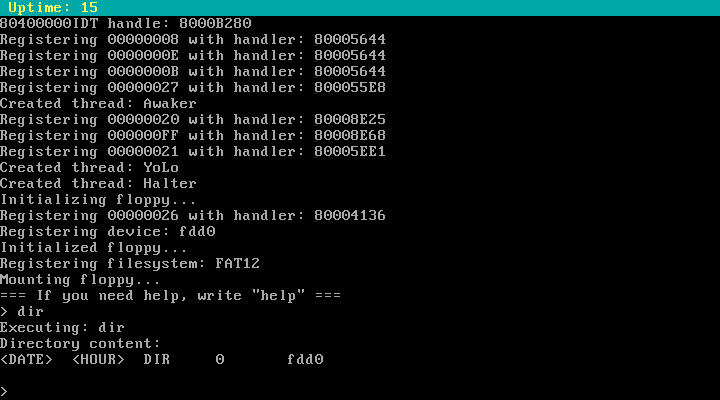

# babyOSv

32-bit operating system for x86 (386/486) written in C.

Features currently implemented:
- Protected mode
- Physical and logical memory allocator
- Kernel-space threads with preemptive scheduler
- Block devices: FDD HDD/ATA
- Partition types: MBR
- Filesystems: FAT12/FAT16/FAT32 virtual(BlkFS)
- Keyboard support
- Fancy terminal with printf-like syntax
- Skeleton of VFS
- Demo shell to test VFS

TODO:
- Improve VFS to be super flexible
- Executing programs in kernel-space
- Graphics mode
- ...
- User-space

# Screenshots

