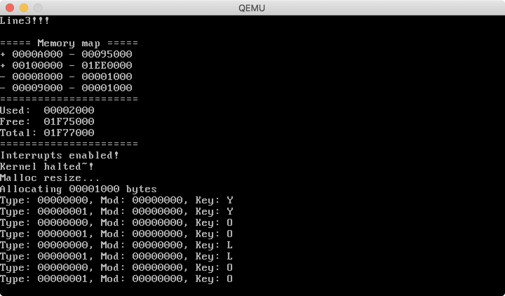

# babyOSv

Next attempt to write 32-bit operating system for x86.
This time main approach is to go to protected mode with paging enabled as fast as possible and start running kernel written in C.

It is a second attempt, since first babyOS is still in-development, but started crashing :(

# Screenshots

